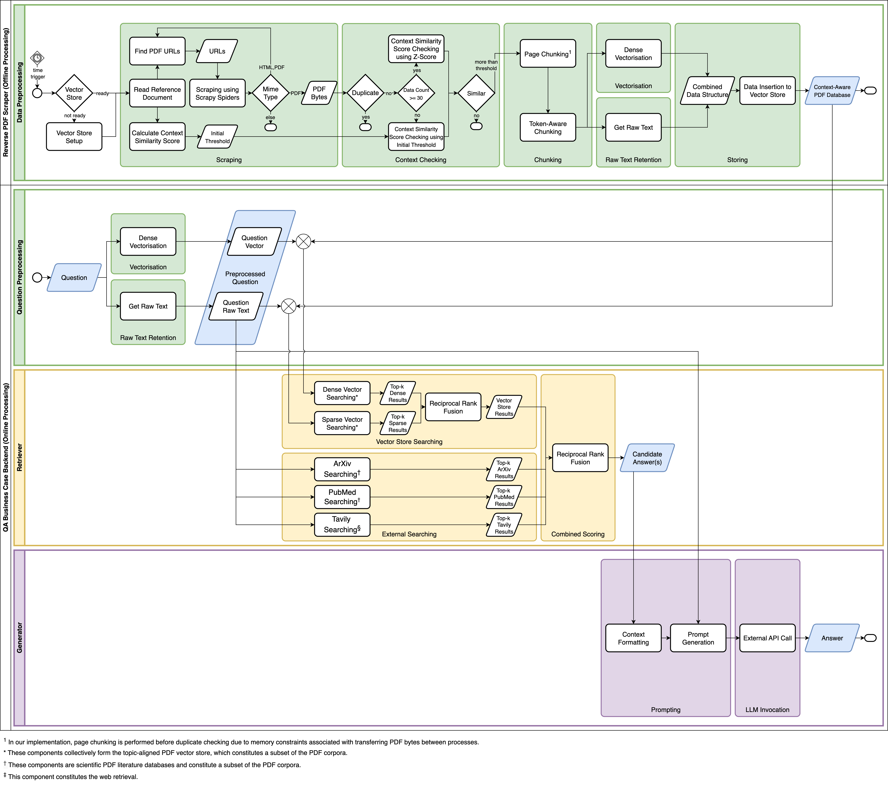
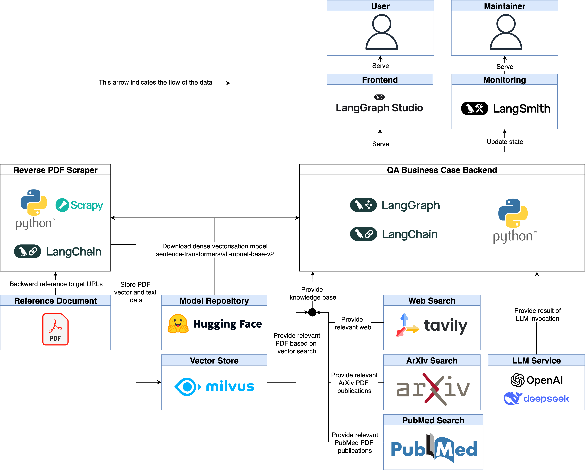
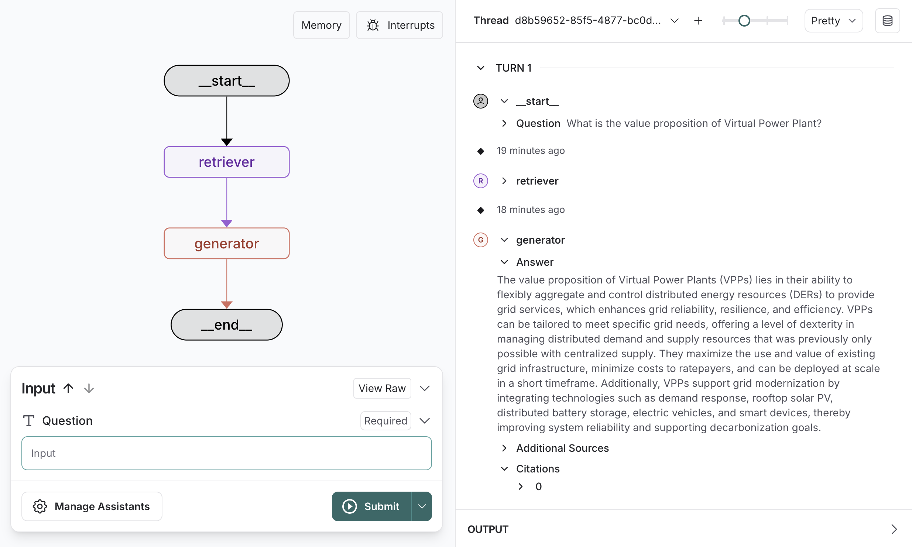

# Question Answering System for Business Cases

## Table of Contents

- [Abstract](#abstract)
- [Manuscript Versions](#manuscript-versions)
- [Supplementary Materials](#supplementary-materials)
- [Related Codebases](#related-codebases)

## Abstract

A business case is a commonly used artefact for justifying project initiation in an organisation. Developing business cases requires extensive knowledge and data acquisition which is facilitated by using search engines and generative AI. While the first usually leads to reliable data, navigating through this data is labour-intensive. Conversely, generative AI delivers answers in seconds, but suffers from unreliable results. To address this trade-off, we introduce the Question-Answering System for Business Cases as a solution supporting business case development. It is based on Retrieval-Augmented Generation and prioritises four key requirements: speed, reliability, up-to-date freshness, and capability of providing options of answer. Specifically, our solution includes two components: (1) a question-answering system and (2) an integrated knowledge base sourced from PDF corpora and web retrieval mechanisms. This system allows users to create and update the Context-Aware PDF Database based on their own input contexts and reference documents. Our empirical reference-free evaluation suggests that our proposed system delivers contextually relevant answers with citations and additional sources in approximately 20 seconds. It also handles question variation and prevents hallucinations effectively.

## Manuscript Versions

This research has evolved through multiple stages:

1. **Master Thesis** (Initial Work)
   - Comprehensive exploration of the question-answering system for business cases
   - [Link to thesis](https://purl.utwente.nl/essays/108365)

2. **Conference Publication** (Submitted)
   - Condensed version highlighting key findings
   - TBD

## Supplementary Materials

This section includes figures, tables, and other supplementary materials that support the main research findings.

### Figures

**Fig. 1. Design Flow Diagram** [This illustration shows the execution order of the system design.]

**Fig. 2. Implementation Diagram** [The Reverse PDF Scraper implements _Data Preprocessing_ component. The QA Business Case Backend implements the _Question Preprocessing_, _Retriever_, and _Generator_ components.]

**Fig. 3. Runtime Example** [The frontend of the system during runtime.]

## Related Codebases

This section links to the implementation codebases and resources associated with this research:
- [**Reverse PDF Scraper**](https://github.com/ilmaalifia/reverse-pdf-scraper)
- [**QA Business Case Backend**](https://github.com/ilmaalifia/qa-business-case-backend)

For each repository, refer to its respective README for setup instructions, dependencies, and usage guidelines.
